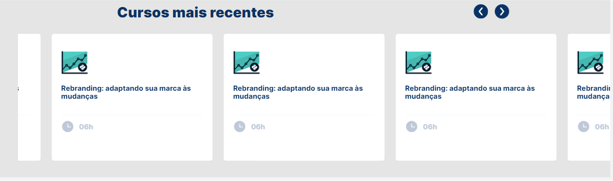

# Teste JavaScript - Essa atualização não faz parte do teste pois fiz após o teste

	

## Criar um carrossel seguindo modelo no figma

- Infelizmente minha soluação inicial teve uma falha, sendo assim essa versão é uma correção
- Mas não esta valida para ser avaliada por esta fora do prazo de entrega.
